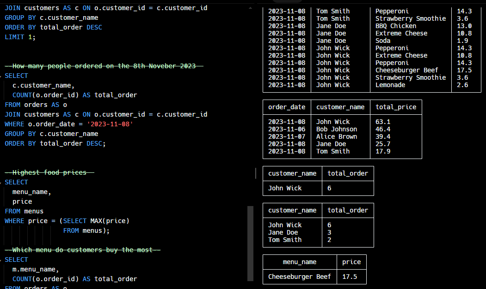
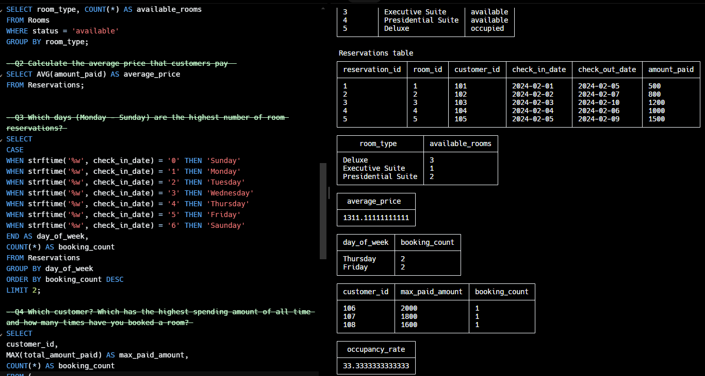

# SQL

Thanks to DataRockie courses, I'm now can a SQL I can grab data, filter it down, and even combine different pieces of data using cool tricks like joins, functions, and stuff called aggregation.

### Mini Projects:
[Pizza Shop with JOIN SUBQUERY](https://replit.com/@sirintramook/sqlhomeworkbatch09mookmick#main.sql)

[GrandParadiseHotel](https://replit.com/@sirintramook/GrandParadiseHotel-Datasets)

